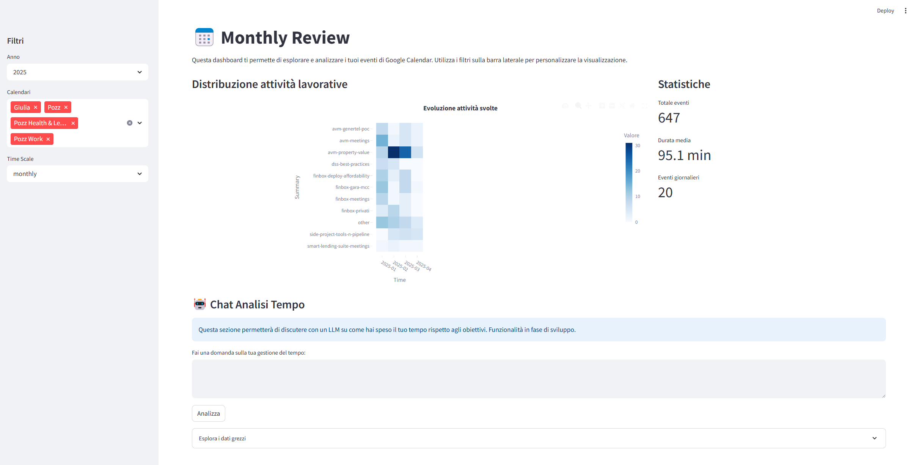

# 📅 Event Tracking – Personal Dashboard powered by LLMs

> A side project to track events, reflections, and personal goals, while experimenting with LLMs and modern Python libraries.

## 🎯 Project Goal

Event Tracking is a mini application designed to help me:
- Keep track of my daily activities and personal goals.
- Visualize and analyze how I'm evolving over time.
- Experiment with and learn how to use **Large Language Models (LLMs)** and modern libraries in a meaningful personal project.

## 💡 Key Features

- **Event Calendar**: log daily activities with notes.
- **Weekly / Monthly Reviews**: reflect on productivity and energy levels.
- **Multi-Scale Planning**: define focus and goals across daily, monthly, and yearly horizons.
- **Interactive Dashboard**: visualize activities by category and energy levels.
- **LLM Integration** *(work in progress)*: generate automatic insights and summaries from logged events.

## 🧰 Tech Stack

- [Streamlit](https://streamlit.io/) → for building the interactive user interface
- [LangChain](https://www.langchain.com/) → to orchestrate interactions with LLMs
- [DuckDB](https://duckdb.org/) → for lightweight local data storage and querying
- [UV](https://docs.astral.sh/uv/) → An extremely fast Python package and project manager, written in Rust.

## 🛠️ Project Status

⚠️ **In early development (alpha)**  
The main goal is to explore and learn, so the codebase will evolve iteratively with frequent experiments and refactoring.

## 🧪 Learning Objectives

- Apply **LLM integration** in mini-apps.
- Learn and experiment with **LangChain**, **DuckDB**, **Streamlit**.
- Build a personal dashboard that is useful and sustainable over time.

## Endpoint

- create_calendar_db.py: Script that download events from my calendars and categorize them using a personal classification. (RK = If expired, deleted the token file)
- dashboard.py: 

## Dashboard

    streamlit run development/dashboard.py